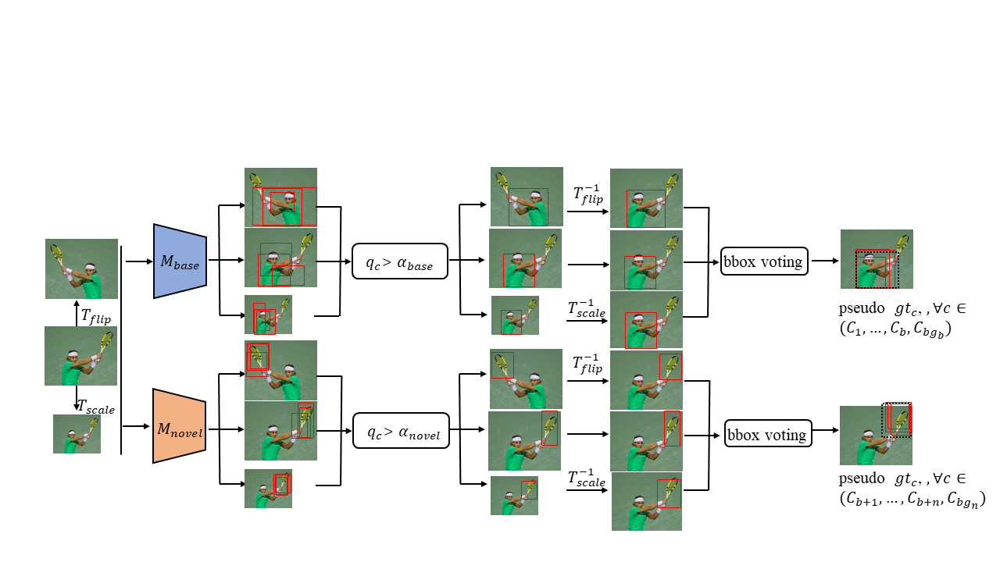
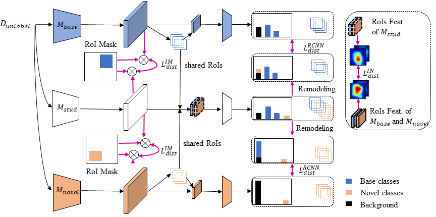

# Bridging-Non-Co-occurrence

**About**

This is the source code for our paper

Na Dong, Yongqiang, Zhang Mingli Ding, Gim Hee Lee. Bridging Non Co-occurrence with Unlabeled In-the-wild Data for Incremental Object Detection. In Neurips 2021.

 Recently, several incremental learning methods are proposed to mitigate catastrophic forgetting for object detection. Despite the effectiveness, these methods require co-occurrence of the unlabeled base classes in the training data of the novel classes. This requirement is impractical in many real-world settings since the base classes do not necessarily co-occur with the novel classes. In view of this limitation, we consider a more practical setting of complete absence of co-occurrence of the base and novel classes for the object detection task. We propose the use of unlabeled in-the-wild data to bridge the non co-occurrence caused by the missing base classes during the training of additional novel classes. To this end, we introduce a blind sampling strategy based on the responses of the base-class model and pre-trained novel-class model to select a smaller relevant dataset from the large in-the-wild dataset for incremental learning. We then design a dual-teacher distillation framework to transfer the knowledge distilled from the base- and novel-class teacher models to the student model using the sampled in-the-wild data. 

Our network consists of a blind sampling stage and a dual-teacher distillation stage. The useful data from large amounts of unlabeled in-the-wild data are effectively selected in the first stage for coarse estimation. The sampled data are utilized to distill knowledge from the base and novel teacher models to the student model in the second stage.


<p align="center">
  
</p>

<p align="center">
  
</p>

For more details, please refer to [our paper](http://arxiv.org/abs/2110.15017).

**Bibtex**

```
@article{dong2021bridging,
  title={Bridging Non Co-occurrence with Unlabeled In-the-wild Data for Incremental Object Detection},
  author={Dong, Na and Zhang, Yongqiang and Ding, Mingli and Lee, Gim Hee},
  journal={Advances in Neural Information Processing Systems},
  volume={34},
  year={2021}
}
```

**Dependencies**

1. Python 2.7
2. Pytorch 1.0.0

Please refer to requirements.txt for more details on dependencies.

**Download datasets**

* PASCAL_VOC 07: Please follow the instructions in py-faster-rcnn to prepare VOC datasets. Actually, you can refer to any others. After downloading the data, creat softlinks in the folder ./data/.

* COCO: Please also follow the instructions in py-faster-rcnn to prepare the data.

* Open Images Dataset: Download the [Open Images Dataset](https://github.com/openimages/dataset) and put it under the folder ./data/.


**Acknowledgements**

The code is build on previous work code. If you use our code, please also consider cite:

```
@article{jjfaster2rcnn,
    Author = {Jianwei Yang and Jiasen Lu and Dhruv Batra and Devi Parikh},
    Title = {A Faster Pytorch Implementation of Faster R-CNN},
    Journal = {https://github.com/jwyang/faster-rcnn.pytorch},
    Year = {2017}
}

@inproceedings{renNIPS15fasterrcnn,
    Author = {Shaoqing Ren and Kaiming He and Ross Girshick and Jian Sun},
    Title = {Faster {R-CNN}: Towards Real-Time Object Detection
             with Region Proposal Networks},
    Booktitle = {Advances in Neural Information Processing Systems ({NIPS})},
    Year = {2015}
}
```
